# Stock Tweet Analysis: Do Influential Voices Move Markets?

---

## Overview

This project investigates whether tweets from high-profile financial influencers carry measurable predictive power over stock price movements. We collected tweets from six well-known figures, identified the stocks they mentioned, scored each tweet's sentiment using a financial-domain language model, and then applied a battery of statistical tests to determine whether that sentiment signal leads, lags, or correlates with daily stock returns.

**Influencers tracked:**
| Handle | Person |
|---|---|
| @elonmusk | Elon Musk |
| @realDonaldTrump | Donald Trump |
| @CathieDWood | Cathie Wood |
| @jimcramer | Jim Cramer |
| @michaeljburry | Michael Burry |
| @RayDalio | Ray Dalio |

**Stocks analyzed:** AAPL, AMZN, AVGO, GOOG, META, MSFT, NVDA, TSLA, TSM, TCEHY

---

## Project Architecture

```
stock-tweet-analysis/
├── data/
│   ├── stock_influencer_tweets.db      ← SQLite: raw tweets + stock mentions
│   ├── StockPrices.db                  ← SQLite: consolidated OHLCV price data
│   ├── stock-influencer-tweets-neo4j.dump  ← Neo4j graph dump
│   └── influentialPeople.txt
├── src/
│   ├── main.py                         ← End-to-end pipeline entry point
│   ├── config.py
│   └── utils/
│       ├── sentiment_utils.py          ← FinTwitBERT inference
│       ├── stock_utils.py              ← Price preprocessing & merging
│       ├── analysis_utils.py           ← GARCH, Granger, ADF tests
│       └── plotting_utils.py
├── plots/                              ← All generated visualizations
├── result/                             ← CSV outputs from statistical tests
└── queries/
    └── Neo4j_Query.txt                 ← Sample Cypher queries
```

---

## Data Pipeline

The full pipeline runs end-to-end from raw database records to statistical results:


1. **Ingest** — Query `stock_influencer_tweets.db` for tweets and stock mention tags.
2. **Sentiment scoring** — Run each tweet through FinTwitBERT; produce a daily average sentiment score per stock (bearish = −1, neutral = 0, bullish = +1).
3. **Price preprocessing** — Load daily OHLCV data from `StockPrices.db`, compute percentage daily returns, reindex to a continuous calendar, and forward-fill gaps.
4. **Merge** — Join sentiment and return series on date, aligning at lags 0–5.
5. **Statistical analysis** — Run Pearson correlations, Granger causality tests, ADF stationarity checks, and GARCH(1,1) models.
6. **Visualize** — Produce time-series charts, summary bar charts, network graphs, and result tables.

---

## Sentiment Analysis Model

We used **FinTwitBERT** (`StephanAkkerman/FinTwitBERT-sentiment`), a BERT model fine-tuned specifically on financial Twitter data. Unlike general-purpose sentiment models, FinTwitBERT understands domain vocabulary such as ticker symbols, options jargon, and market-specific expressions.

- **Classes:** `bearish` (−1), `neutral` (0), `bullish` (+1)
- **Batching:** 32 tweets per forward pass for efficiency
- **Output:** Daily mean sentiment score per stock, aggregated across all influencer tweets that mentioned the ticker that day

---

## Exploratory Analysis

### Tweet Volume by Stock

The chart below shows how many tweets mentioned each stock across the full dataset. TSLA and AAPL attract the most coverage — consistent with Elon Musk's heavy presence in the data.

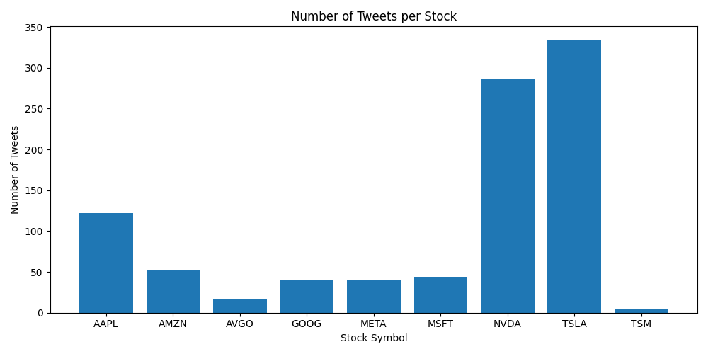

### Tweet Volume by Influencer and Stock

Breaking volume down by person reveals who drives coverage for each stock. Musk dominates TSLA mentions; Trump contributes more to macro-sensitive names.

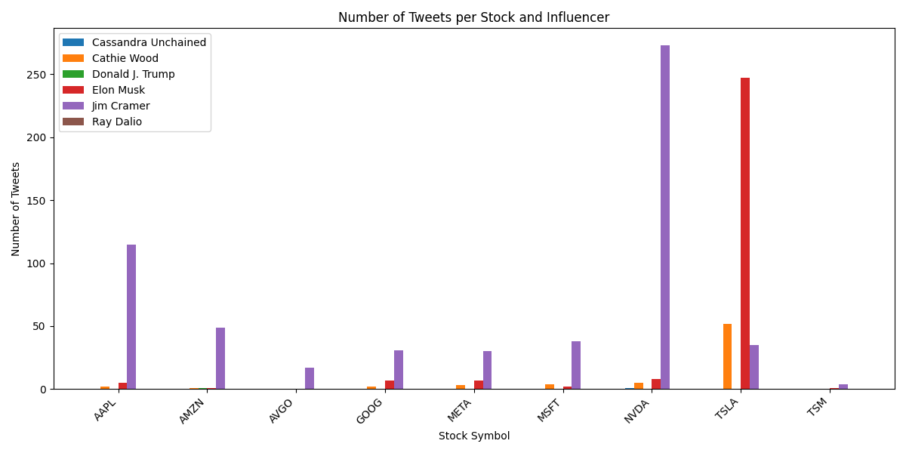

### Retweet Behavior

The retweet plot shows the relative amplification each influencer receives. Higher retweet counts indicate broader organic reach, which may amplify market impact.

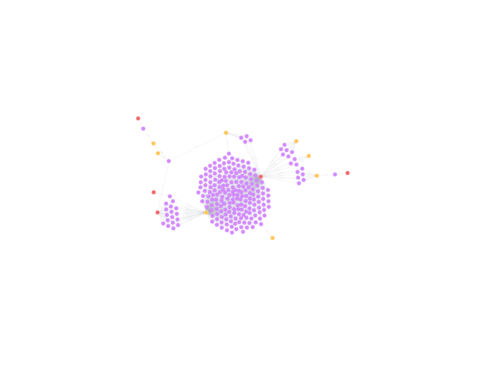

---

## Network Analysis

### Neo4j Graph — Influencer → Stock Relationships

We modeled the dataset as a property graph in Neo4j, with influencer nodes connected to stock nodes via `MENTIONED` edges, weighted by tweet frequency.

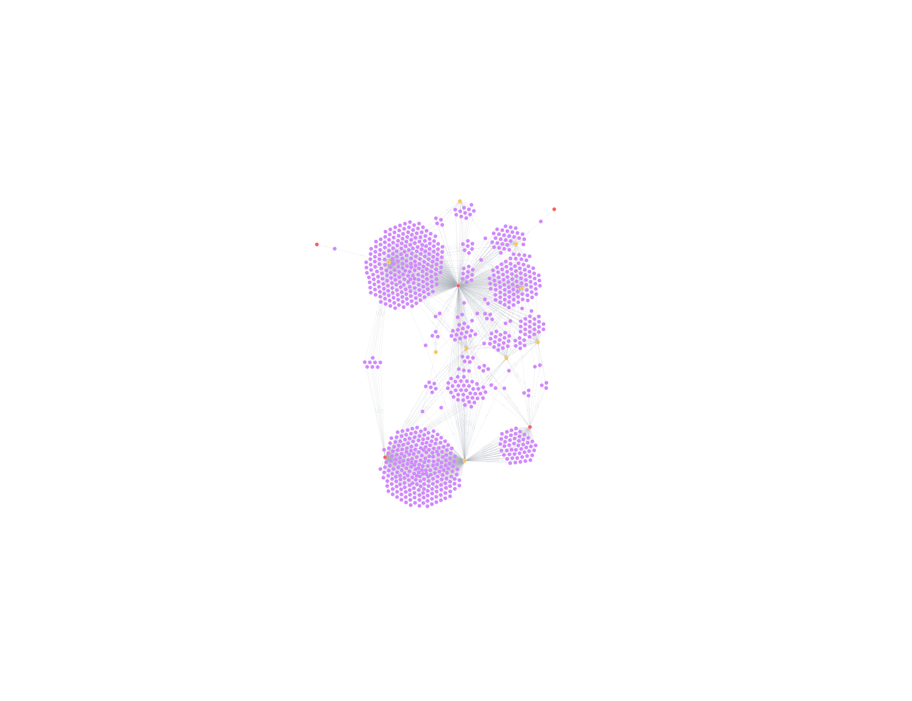

### NetworkX Graph — Full Bipartite Network

The same graph rendered with NetworkX shows the bipartite structure clearly. Elon Musk forms a dense hub with a large number of stock connections, while others (Burry, Dalio) are more concentrated in a handful of names.

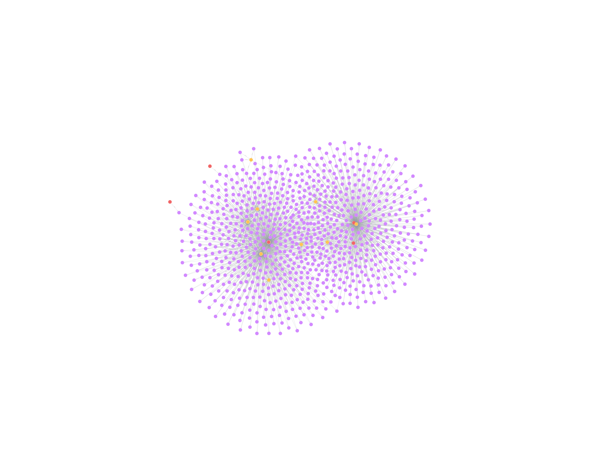

**Sample Cypher query used to extract relationships:**
```cypher
MATCH (p:Person)-[r:MENTIONED]->(s:Stock)
RETURN p.name, s.ticker, count(r) AS mentions
ORDER BY mentions DESC
```

---

## Time-Series Charts: Tweet Volume vs. Price Change

Each chart overlays the daily tweet count mentioning a stock (bars, left axis) against the stock's daily percentage price change (line, right axis). These visualizations let us visually inspect whether spikes in influencer activity coincide with price moves.

### AAPL
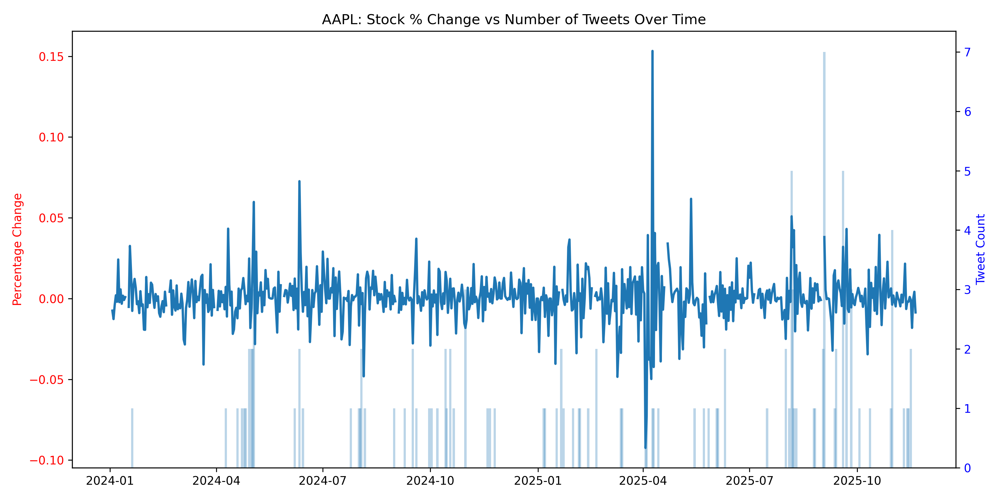

### AMZN
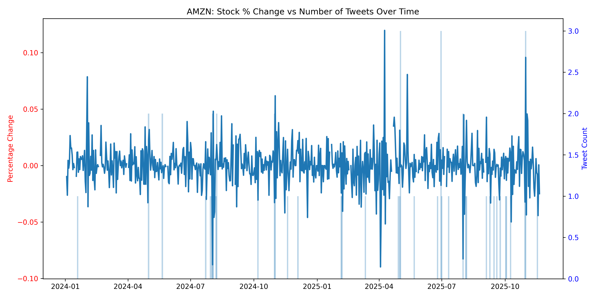

### AVGO
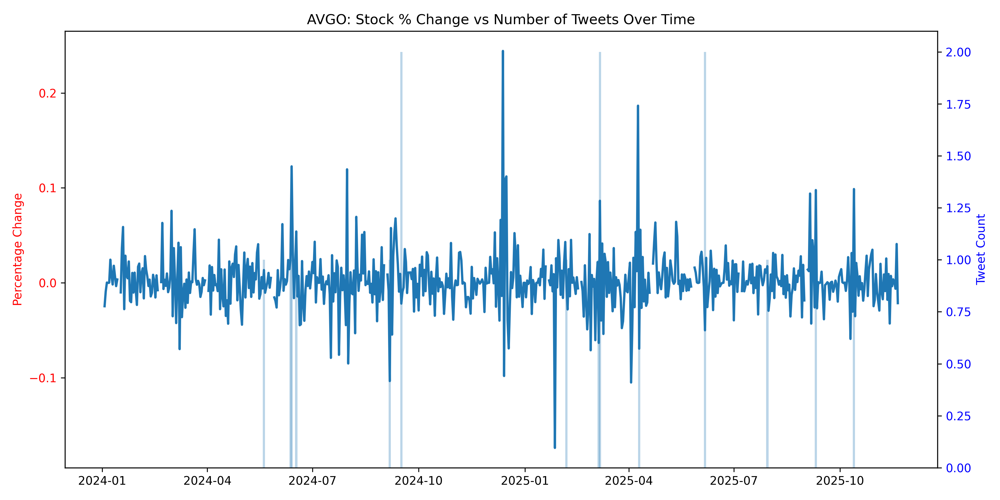

### GOOG
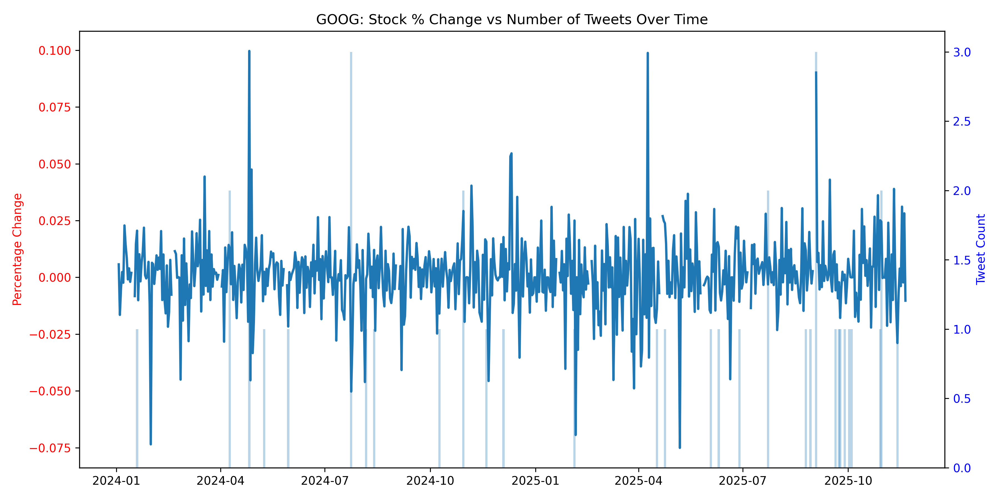

### META
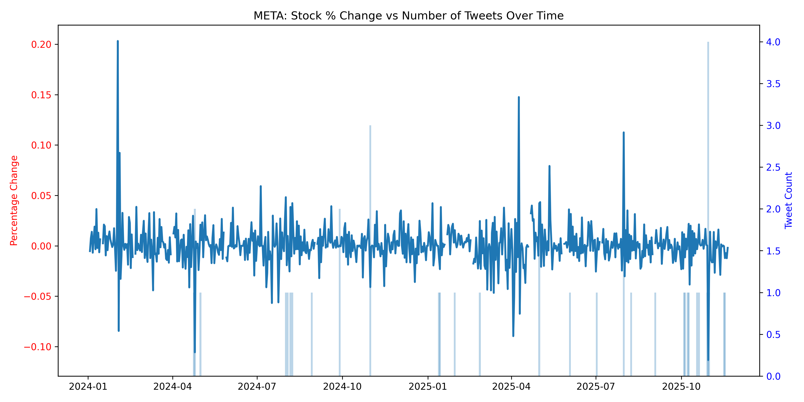

### MSFT
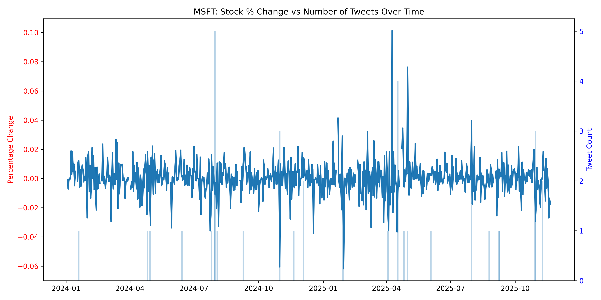

### NVDA
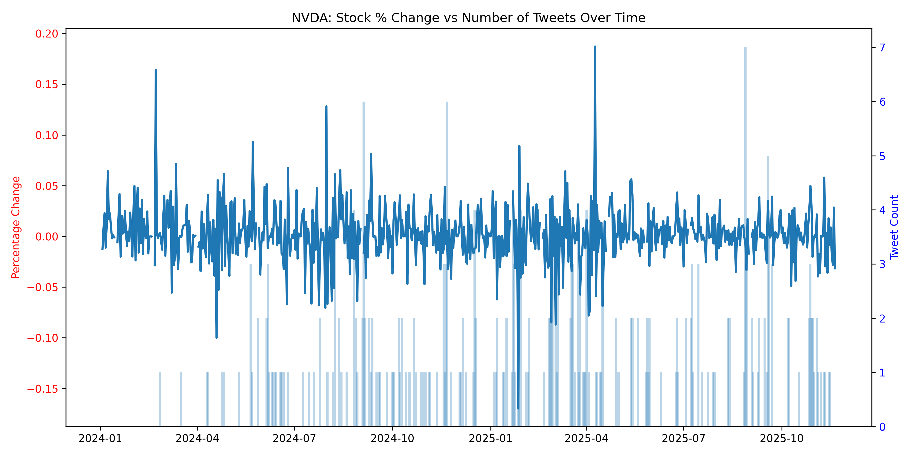

### TSLA
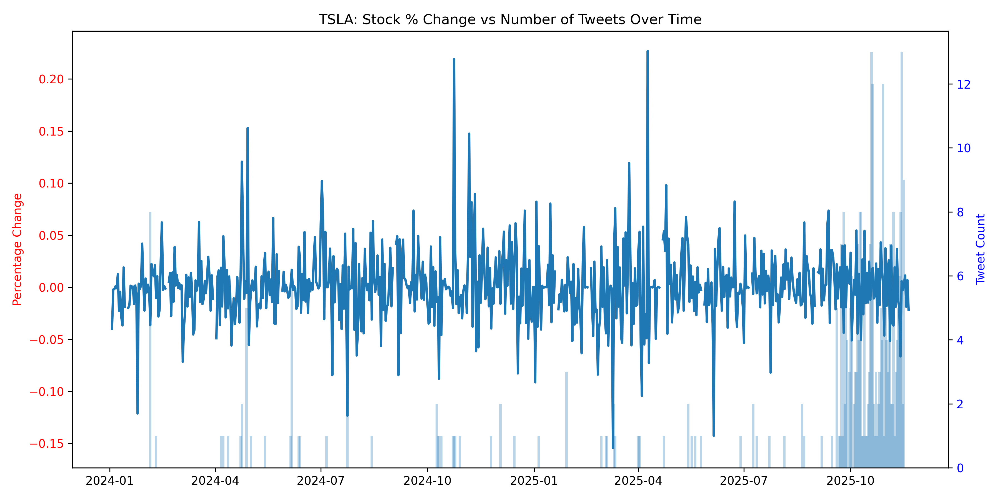

### TSM
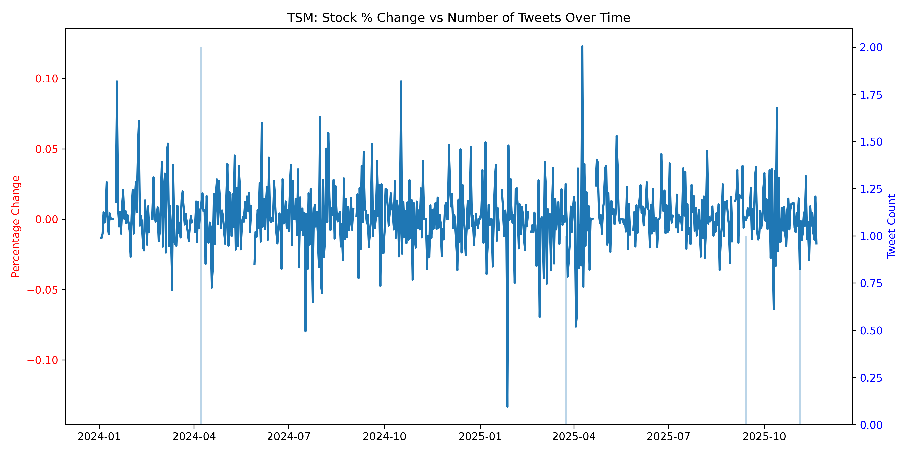

---

## Statistical Results

### 1. Sentiment–Return Correlation

We computed the Pearson correlation between daily average sentiment and daily stock returns at lags 0 through 5 (i.e., "does today's sentiment predict returns up to 5 days later?").


**Full results:**

| Ticker | Lag 0 | Lag 1 | Lag 2 | Lag 3 | Lag 4 | Lag 5 |
|--------|------:|------:|------:|------:|------:|------:|
| AAPL   | −0.03 |  0.05 | −0.01 | −0.01 | −0.01 |  0.07 |
| AMZN   | −0.02 |  0.02 |  0.02 |  0.01 | −0.01 |  0.04 |
| AVGO   |  0.07 | −0.07 |  0.03 | −0.02 | −0.04 |  0.00 |
| GOOG   |  0.07 |  0.01 |  0.01 | −0.02 |  0.00 | −0.09 |
| META   |  0.08 |  0.11 |  0.00 |  0.00 |  0.06 |  0.01 |
| MSFT   |  0.01 |  0.03 |  0.02 |  0.00 |  0.06 |  0.07 |
| NVDA   |  0.01 |  0.03 | −0.01 |  0.05 |  0.02 |  0.05 |
| TSLA   |  0.05 |  0.06 |  0.00 | −0.02 |  0.00 |  0.01 |
| TSM    | −0.02 |  0.01 | −0.03 | −0.02 | −0.05 |  0.05 |

**Key takeaway:** All correlations are very weak (|r| < 0.15 across the board). The strongest signal is META at lag 1 (r = 0.11), meaning sentiment may have a very small tendency to precede META returns by one day — but the effect is negligible in magnitude. No stock shows a consistent directional pattern across lags.

---

### 2. Granger Causality Tests

The Granger causality test asks: *does knowing yesterday's (or the past N days') sentiment improve our forecast of today's return, beyond what returns alone can predict?* We tested lags 1–5 using four variants (LR test, params F-test, SSR χ² test, SSR F-test). Both series passed the ADF stationarity requirement (p ≪ 0.05 for all stocks).

**Result: No significant Granger causality found for any stock at any lag (all p-values > 0.05).**

Notable near-misses:
- **GOOG at lag 2**: p ≈ 0.083 across all test variants — the closest any stock came to the significance threshold, but still does not cross it.
- All other tickers returned p-values well above 0.3, often above 0.7.

**ADF stationarity confirmation:** Both the return series and the sentiment series are stationary for all stocks (p-values ranging from ~1.4×10⁻²⁴ to effectively 0), satisfying the pre-condition for Granger testing.

---

### 3. GARCH(1,1) Volatility Modeling

GARCH(1,1) models whether tweet sentiment shifts the baseline volatility of a stock's returns. The model parameters reveal how much volatility is driven by recent shocks (α) versus long-run persistence (β).


**Full results:**

| Ticker | μ     | μ p-val | ω    | α₁   | α₁ p-val | β    | β p-val | AIC     | Notes |
|--------|------:|--------:|-----:|-----:|----------:|-----:|--------:|--------:|-------|
| AAPL   | 0.08  | 0.15    | 0.46 | 0.15 | 0.20      | 0.64 | 0.07    | 2352.98 | Relatively stable; low shock sensitivity |
| AMZN   | 0.03  | 0.57    | 1.59 | 0.59 | **0.01**  | 0.06 | 0.59    | 2587.74 | Reactive to shocks but low persistence |
| AVGO   | 0.11  | 0.31    | 1.95 | 0.21 | 0.10      | 0.59 | **0.00**| 3264.26 | Persistence-dominated volatility |
| GOOG   | 0.17  | **0.03**| 2.21 | 0.15 | 0.25      | 0.05 | 0.72    | 2546.10 | Mostly constant volatility, little clustering |
| META   | 0.15  | 0.08    | 1.01 | 0.08 | 0.09      | 0.70 | **0.00**| 2853.08 | Classic GARCH; slow decay, long memory |
| MSFT   | 0.06  | 0.27    | 0.09 | 0.05 | 0.13      | 0.89 | **0.00**| 2133.54 | Very high persistence; volatility lingers |
| NVDA   | **0.31** | **0.00** | 0.27 | 0.06 | 0.13  | 0.91 | **0.00**| 3228.17 | Highest mean return; extreme persistence |
| TSLA   | 0.14  | 0.33    | 0.30 | 0.01 | 0.54      | **0.96** | **0.00** | 3569.63 | Highest volatility persistence of all stocks |
| TSM    | 0.20  | **0.02**| 4.18 | 0.14 | 0.07      | 0.03 | 0.88    | 2960.55 | Elevated baseline volatility; shock-driven |

**Key takeaways:**
- **TSLA** has the highest volatility persistence (β = 0.96, p < 0.01): once it becomes volatile, it stays volatile for many days. This is consistent with TSLA being driven by narrative cycles rather than fundamentals.
- **NVDA** has the highest statistically significant mean daily return (μ = 0.31%, p < 0.01) with very high persistence (β = 0.91), reflecting its strong multi-year growth trend.
- **AMZN** is an outlier — it reacts strongly to shocks (α₁ = 0.59, p = 0.01) but reverts quickly (β = 0.06), suggesting sharp but short-lived volatility spikes.
- **GOOG** shows little evidence of volatility clustering at all (both α and β insignificant), meaning its daily variance is roughly constant.
- Notably, sentiment does not appear as a statistically significant driver of volatility in the GARCH framework for any stock — the volatility dynamics are better explained by their own past behavior.

---

## Insights and Interpretation

### 1. Influencer sentiment has negligible predictive power for returns

The correlation and Granger results converge on the same conclusion: knowing how bullish or bearish our six influencers were about a stock on a given day tells you essentially nothing about where that stock will go tomorrow or in the next five days. The strongest observed correlation (META, lag 1, r = 0.11) is economically trivial.

This does not mean influencers have no market impact — it means their impact, if any, is already priced in on the same day the tweet is published (consistent with market efficiency), or is obscured by noise in a dataset of only six voices.

### 2. Volatility is self-perpetuating, not sentiment-driven

The GARCH analysis reveals that for most stocks, especially TSLA, MSFT, and NVDA, volatility is strongly auto-correlated. Past volatility predicts future volatility far better than any external sentiment signal does. This "volatility clustering" is a well-known empirical feature of financial markets and is captured here cleanly.

### 3. Each stock has a distinct volatility regime

- **High-persistence stocks** (TSLA β=0.96, NVDA β=0.91, MSFT β=0.89): volatility shocks fade slowly. Extended calm periods are followed by extended turbulent periods.
- **Shock-reactive stocks** (AMZN α₁=0.59): volatility spikes sharply after news but normalizes quickly.
- **Constant-variance stocks** (GOOG, TSM): neither shock-sensitive nor persistent; their variance is largely stable.

### 4. The influencer network is highly asymmetric

The network graphs show that Elon Musk is responsible for a disproportionate share of stock mentions. This concentration means the sentiment signal for highly-mentioned stocks (TSLA, AAPL) is largely one person's opinion, while less-covered stocks have sparse, unreliable sentiment timelines.

### 5. NVDA's mean return is the only statistically significant alpha

Across all nine GARCH models, NVDA is the only stock whose mean return (μ = 0.31%/day) is statistically distinguishable from zero (p < 0.01). This reflects NVDA's exceptional 2024–2025 price appreciation rather than any sentiment signal.

---

## Challenges

### Data sparsity
Many trading days had zero tweets mentioning a given stock. Forward-filling sentiment values is a necessary but imperfect workaround — it propagates stale sentiment into days when no new information was actually expressed, potentially diluting any real signal.

### Selection bias in influencer choice
The six influencers were chosen for their fame and financial commentary, but they are a heterogeneous group. Elon Musk tweets primarily about TSLA and broader macro themes; Michael Burry is a long-term macro skeptic; Jim Cramer offers daily stock picks. Aggregating their sentiment into a single score per stock treats very different communication styles equivalently.

### Temporal alignment
Tweets are timestamped by publication time, but markets operate during specific hours. A tweet posted at 11 PM cannot move that day's closing price. Aligning tweets to the *next* trading day's open versus the same day's close is a judgment call that could meaningfully affect lag-0 vs. lag-1 correlations.

### Small sample size per stock
For some stocks (e.g., TCEHY, AVGO), the total number of tweets mentioning them is small. Statistical tests — especially Granger causality — have low power with limited observations, meaning we may fail to detect a real effect simply due to insufficient data.

### Domain model limitations
FinTwitBERT was trained on a broad corpus of financial tweets, but it may struggle with sarcasm, indirect references, or tweets that mention a stock in a neutral news-forwarding context rather than as a genuine opinion. A tweet by Jim Cramer saying "People are worried about AAPL — I'm not" would ideally be scored bullish, but sentiment models often anchor on surface-level negative words.

### Confounding factors
Stock returns are driven by earnings releases, macro events, Fed decisions, sector rotations, and countless other factors. Influencer sentiment is one very noisy input. Without controlling for these confounders, detecting a marginal sentiment effect is inherently difficult.

---

## How to Run

**Prerequisites:**
```
pip install pandas numpy transformers torch statsmodels arch matplotlib networkx pyvis neo4j
```

**Run the full pipeline:**
```bash
python src/main.py
```

Results are written to `result/` and plots to `plots/`.

**Rebuild the stock price database from raw training/testing DBs:**
```bash
python src/scripts/createStockPricesDB.py
```

**Render the Neo4j network interactively:**
Open `notebooks/Plot_Neo4j_Interactive.ipynb` in Jupyter. Requires a running Neo4j instance loaded with `data/stock-influencer-tweets-neo4j.dump`.

---

## Tech Stack

| Component | Tool |
|---|---|
| Relational storage | SQLite (`sqlite3`) |
| Graph storage | Neo4j |
| Sentiment model | FinTwitBERT (HuggingFace `transformers`) |
| Statistical tests | `statsmodels` (Granger, ADF), `arch` (GARCH) |
| Data wrangling | `pandas`, `numpy` |
| Visualization | `matplotlib`, `networkx`, `pyvis` |

---

## Conclusion

Using sentiment extracted from tweets by six major financial influencers, we found **no statistically significant evidence** that social media sentiment predicts stock returns at any lag from 0 to 5 days. Granger causality tests uniformly failed to reject the null, and Pearson correlations were universally near zero.

The GARCH analysis offered the most informative results: volatility is strongly self-perpetuating in most stocks, particularly TSLA and NVDA, and shows characteristic clustering that is independent of the sentiment signal we measured.

These findings are consistent with the **Efficient Market Hypothesis** — if influential voices reliably moved prices, that relationship would be arbitraged away. They also highlight a fundamental challenge in alternative data research: measuring the *marginal* contribution of a noisy social signal in a world already saturated with information.

Future work could incorporate higher-frequency data (intraday), a larger influencer set, reply/retweet graph dynamics, and event-study designs around specific high-impact tweet events to search for more localized effects.
